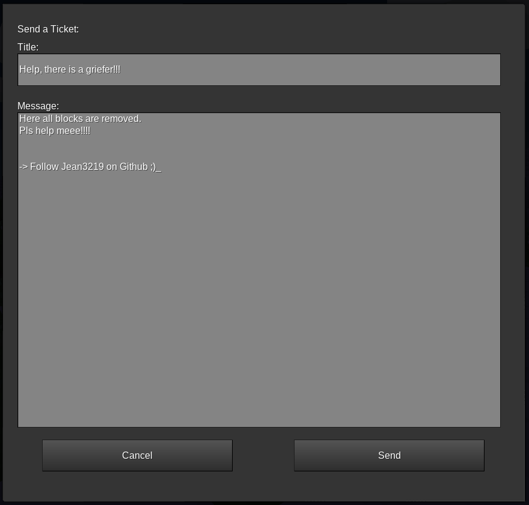
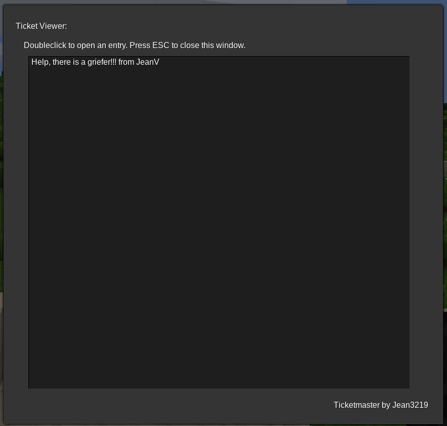
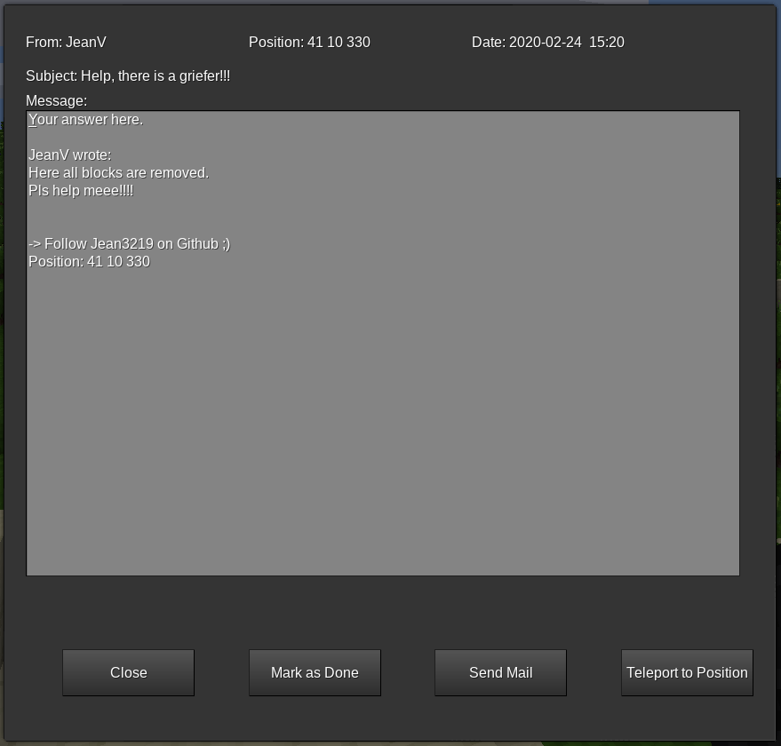

# Jean's Ticketmaster
github:
Depends on:
- https://github.com/minetest-mail/mail

This Mod adds an Support-Ticket System for Servers. Players can send a ticket, which team-members can handle.

## Features:
- Fully working database, saving tickets through server-restarts
- Ticketmaster automaticly saves the location, where something was written. A Team Member can instantly teleport to it
- Supports easy replying via mail.
- Easy handling of all.

## Commands:
### `/ticket`:
- When you are a player then a Dialog opens, on which he can define a subject, and write a message.
- When you are are a team-member (having the `ticketmaster` privilege), then it shows all open tickets. Which you can handle.

## Privileges:
This mod brings the `ticketmaster` privilege whith it. Every Team-Member should have it. See 'Commands' for more details.

## Screenshot:
- Player View:
- Team List View:
- Team Ticket Entry 

## Feedback?
If you have found bugs, or have some ideas, let me know it in the github issues section!
